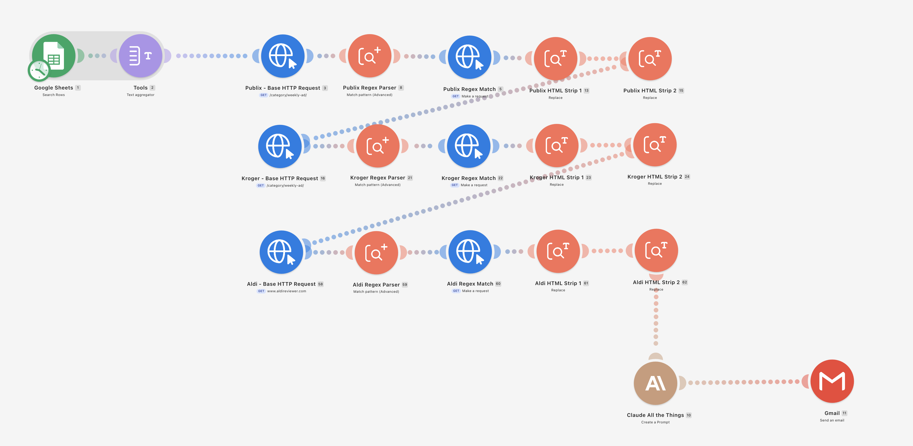

# Grocery Deal Alert — Make.com Blueprint

Automatically checks weekly sale ads from **Publix**, **Kroger**, and **ALDI** every week, matches them against your personal shopping list in Google Sheets, and emails you the results — no coding required.

Built with [Make.com](https://make.com) and Claude AI.



---

## How it works

1. **Google Sheets** — reads your shopping list (one item per row)
2. **Text Aggregator** — joins all rows into a single block of text for Claude
3. **HTTP → Regex → HTTP → HTML Strip** (×3, one per store) — fetches each store's current weekly ad page, extracts the article URL, fetches the article, and strips HTML tags
4. **Claude All the Things** — receives all three ad excerpts and the shopping list; returns only the matching deals in a clean format
5. **Gmail** — emails the results

---

## Prerequisites

- A [Make.com](https://make.com) account (free tier works)
- A [Google account](https://google.com) (for Sheets + Gmail)
- An [Anthropic API key](https://console.anthropic.com) (Claude)

> **Rate limit note:** This scenario sends three large ad pages to Claude in a single request. Anthropic's free Tier 1 limit is 30,000 input tokens/minute, which this may exceed. Adding a small amount of credit ($5–$10) to your Anthropic account upgrades you to Tier 2 (90,000 tokens/minute), which handles the load comfortably.

---

## Setup

### Step 1 — Create your Google Sheet

Create a new Google Sheet named **Grocery List** with these columns in row 1:

```
Category | Subcategory | Brand | Size | Notes
```

Add your items starting in row 2. Example:

| Category | Subcategory | Brand | Size | Notes |
|---|---|---|---|---|
| cheese | | Tillamook | | |
| butter | | Kerrygold | | |
| pasta | | Carbe Diem | | |
| chips | | Tostitos | | |
| coffee | ground | | 12 oz | |
| beef | | | | any beef on sale |

**Rules:**
- Leave **Brand** blank to match any brand in that category
- If **Brand** is filled in, it must match exactly — Claude will not substitute store brands or similar names
- Leave **Size** blank to match any size
- The **Notes** column is for your reference only — it is not sent to Claude

---

### Step 2 — Import the blueprint

1. In Make.com, click **Create a new scenario**
2. Click the **three-dot menu (⋯)** at the bottom → **Import Blueprint**
3. Upload `blueprint.json` from this repo
4. Click **Save**

---

### Step 3 — Connect your accounts

After importing, Make will show orange warning icons on modules that need connections. Click each one and authorize:

| Module | Service | Notes |
|---|---|---|
| Google Sheets (module 1) | Google | Select your **Grocery List** spreadsheet |
| Claude All the Things (module 10) | Anthropic | Paste your API key |
| Gmail (module 11) | Google | Authorize send access |

---

### Step 4 — Point Google Sheets at your spreadsheet

Click **module 1 (Google Sheets — Search Rows)**:
- **Spreadsheet Name** → select **Grocery List**
- **Sheet Name** → **Sheet1**
- **Table contains headers** → **Yes**
- **Column range** → **A-CZ** (default is fine)

---

### Step 5 — Update the Gmail recipient

Click **module 11 (Gmail — Send an email)**:
- Change the **To** field to your email address (or multiple addresses, comma-separated)

---

### Step 6 — Set the schedule

1. Click the **clock icon** at the bottom left of the scenario editor
2. Choose **Weekly**, pick **Wednesday**, set time to **9:00 PM** (or your preferred time)
3. Click **OK**

---

### Step 7 — Test it

Click **Run once** at the bottom of the editor. After a few seconds you should receive an email with matching deals (or "nothing on your list this week" for stores with no matches).

---

## Module map

| # | Module | What it does |
|---|---|---|
| 1 | Google Sheets — Search Rows | Reads every row from your Grocery List sheet |
| 2 | Tools — Text Aggregator | Joins rows into `Category / Subcategory / Brand / Size` lines |
| 3 | HTTP — Publix index | Fetches iheartpublix.com/category/weekly-ad/ |
| 8 | Regex Parser — Publix URL | Extracts the current week's article URL |
| 5 | HTTP — Publix article | Fetches the article page |
| 13 | Text Parser — HTML Strip 1 | Removes all HTML tags |
| 15 | Text Parser — HTML Strip 2 | Isolates the deals section |
| 16 | HTTP — Kroger index | Fetches iheartkroger.com/category/weekly-ad/ |
| 21 | Regex Parser — Kroger URL | Extracts the article URL |
| 22 | HTTP — Kroger article | Fetches the article page |
| 23 | Text Parser — HTML Strip 1 | Removes all HTML tags |
| 24 | Text Parser — HTML Strip 2 | Isolates the deals section |
| 58 | HTTP — ALDI index | Fetches aldireviewer.com |
| 59 | Regex Parser — ALDI URL | Extracts the article URL |
| 60 | HTTP — ALDI article | Fetches the article page |
| 61 | Text Parser — HTML Strip 1 | Removes all HTML tags |
| 62 | Text Parser — HTML Strip 2 | Isolates the deals section |
| 10 | Claude All the Things | Matches shopping list against all three ads |
| 11 | Gmail — Send an email | Emails the results |

---

## Customizing the Claude prompt

The prompt lives inside **module 10 (Claude All the Things)**. Click it to view or edit the full prompt. Key things you can change:

- **Outdated content warning threshold** — currently flags content more than 10 days old
- **Output format** — the `STORE | ITEM | DEAL` format can be adjusted
- **Store brand exclusions** — ALDI store brands (Reggano, Friendly Farms, Kirkwood, etc.) are explicitly excluded from name-brand matches

---

## Adding stores

To add a fourth store you would need to add five modules following the same pattern as Publix/Kroger/ALDI:

1. HTTP module → fetch the store's index page
2. Regex Parser → extract the article URL
3. HTTP module → fetch the article
4. Text Parser (Replace) → strip HTML tags
5. Text Parser (Replace) → isolate the deals section

Then pass the final module's output into the Claude prompt via a new `{{XX.text}}` variable.

---

## Related

- [grocery-deal-alert](https://github.com/ashenroot/grocery-deal-finder-python) — same workflow as a Python script with GitHub Actions (developer version)

---

## License

MIT
